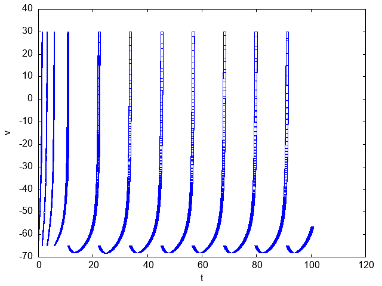

# Flow* sample
## Flow* version
This repository's [Flow*](https://flowstar.org/) is versoin [2.1.0](https://www.cs.colorado.edu/~xich8622/src/flowstar-2.1.0.tar.gz).

## Installation
```
git clone https://github.com/tagomaru/flowstar.git
cd flowstar
docker build -t flowstar -f ./Dockerfile .
```

## Usage (demos)
### official example ([Spiking neuron model](https://flowstar.org/examples/))
```
./flowstar.sh neuron
```

open models/images/neuron.png



### sigmoid
```
./flowstar.sh sigmoid
```

open models/images/sigmoid.png


### figure2 of [Verisig: verifying safety properties of hybrid systems with neural network controllers](https://arxiv.org/pdf/1811.01828.pdf)
```
./flowstar.sh figure2_dnn_to_hybrid
```

open models/images/figure2_dnn_to_hybrid.png


